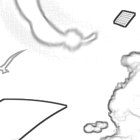

# Picture2Lineart

图片转线稿

## 效果展示

```
$ python extract.py -i "mizore_part.png" -o "result" --kernel_size 3 --contrast_threshold 0.96
[成功]线稿保存于result/mizore_part.png
```


## 使用方法

### 帮助文档

```
$ python extract.py -h                                                                   
usage: extract.py [-h] [--picture_path PICTURE_PATH] [--output_folder_path OUTPUT_FOLDER_PATH] [--kernel_size KERNEL_SIZE] [--contrast_threshold CONTRAST_THRESHOLD]

optional arguments:
  -h, --help            show this help message and exit
  --picture_path PICTURE_PATH, -i PICTURE_PATH
                        输入图像的路径
  --output_folder_path OUTPUT_FOLDER_PATH, -o OUTPUT_FOLDER_PATH
                        输出文件夹的路径
  --kernel_size KERNEL_SIZE
                        int >= 2 单次处理像素块边长 越小得到的线稿线条越纤细
  --contrast_threshold CONTRAST_THRESHOLD
                        (0.0,1.0] kernel内对比度的门限 推荐值0.96 值为1.0时图像的所有变化都经过转换 但变化缓慢处可能会较脏 值较小时可能出现全图空白 无法得到线稿
```

### 参数影响

#### kernel_size


--kernel_size 2 --contrast_threshold 0.96


--kernel_size 3 --contrast_threshold 0.96



--kernel_size 5 --contrast_threshold 0.96


--kernel_size 10 --contrast_threshold 0.96

#### contrast_threshold


--kernel_size 3 --contrast_threshold 0.96


--kernel_size 3 --contrast_threshold 1.0

## References

[GitHub | JingyuNankin/Picture-to-line-draft](https://github.com/JingyuNankin/Picture-to-line-draft) [LICENSE](https://github.com/JingyuNankin/Picture-to-line-draft/issues/1)
